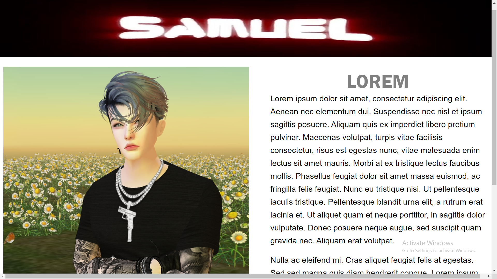

# Responsive Page

> One paragraph statement about the project.

Additional description about the project and its features.

## Built With

- HTML & CSS

## Live Demo

[Live Demo Link](file:///C:/Users/USER/Desktop/Responsive-page/index.html)

## Authors

👤 **Author1**

- Github: [@githubhandle](https://github.com/SamuelOdimegwu)
- Linkedin: [linkedin](https://www.linkedin.com/in/samuel-odimegwu-0364291a8/)

## 🤝 Contributing

Contributions, issues and feature requests are welcome!

## Show your support

Give a ⭐️ if you like this project!

## Acknowledgments

- Hat tip to Dani Krossing

## 📝 License

This project is [MIT](lic.url) licensed.